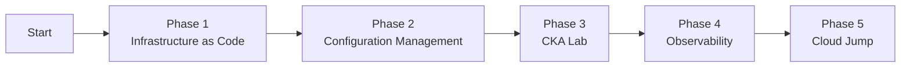

# Plan: CKA Certification & Platform Engineering Path

**Mission:** Transform a physical Nutanix cluster into a professional-grade Platform Engineering pipeline, building a portfolio of evidence that proves end-to-end data center automation skills.

---

## Overview

| Detail | Info |
|---|---|
| Created | April 3, 2026 |
| Target | CKA Certification + Platform Engineering Portfolio |
| Infrastructure | Nutanix On-Prem (WOLF2224SATA-NVME Cluster) |
| Timeline | 6-12 Months |

---

## Roadmap Summary



---

## Phase 1: Infrastructure as Code 

**Goal:** Stop using the Prism UI. Manage Intel nodes via code.

### Steps

1. Workstation setup
Install Terraform on your local machine or a dedicated management VM.
2. Write Terraform blueprint (`.tf` files) and connect to Prism Central.

```hcl
# VM Specifications
# Control Plane: 1x VM (Ubuntu 22.04+, 2 vCPUs, 8GB RAM)
# Worker Nodes:  3x VM (Ubuntu 22.04+, 2 vCPUs, 4GB RAM)
```

3. Execute deployment

```bash
terraform apply
```

---

## Phase 2: Configuration Management

**Goal:** Treat VMs like "cattle, not pets." Avoid manual per-node setup.

### Steps

1. Install Ansible on management VM.
2. Write kubeadm prep playbook (`setup-k8s.yml`).
3. Run playbook.

```bash
ansible-playbook setup-k8s.yml
```

**Validation Checkpoint:** All nodes are ready for kubeadm, kubectl, kubelet installation.

---

## Phase 3: CKA Lab

**Goal:** Build the cluster manually to master the CKA curriculum.

### Steps

1. Initialize cluster.

```bash
kubeadm init
```

2. Install CNI plugin.
Options: Calico or flannel.

3. Join worker nodes.

```bash
kubeadm token create --print-join-command
```


**Validation Checkpoint:** Complete Killer.sh simulator with a passing score.

---

## Phase 4: Observability

**Goal:** Leverage validation experience. A platform is not complete until it is monitored.

### Steps

1. Install Helm.

2. Deploy monitoring stack.

3. Build Grafana dashboard.
- CPU and RAM usage: Nutanix VMs vs Kubernetes pods
- Cluster resource utilization

 **Validation Checkpoint:** Dashboard shows full-stack visibility from hardware to container.

---

## Phase 5: Cloud Jump

## 2026 Target Profile

| Category | Details |
|---|---|
| Specialty | System Integration/Validation && Hybrid Platform Engineering (On-Prem + Cloud) |
| Toolbox | Nutanix, Terraform, Ansible, Kubernetes (CKA), AWS (SAA) |


## Tech Stack

Nutanix, Terraform, Ansible, Kubernetes, AWS, Prometheus, Grafana

---

*Last Updated: June 2026*