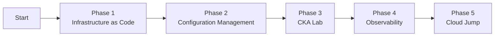

# Golden Plan: CKA Certification & Platform Engineering Path

**Mission:** Transform a physical Nutanix cluster into a professional-grade Platform Engineering pipeline, building a portfolio of evidence that proves end-to-end data center automation skills.

---

## 📋 Overview

| Detail | Info |
|---|---|
| Created | April 3, 2026 |
| Target | CKA Certification + Platform Engineering Portfolio |
| Infrastructure | Nutanix On-Prem (WOLF2224SATA-NVME Cluster) |
| Timeline | 6-12 Months |

---

## 🗺️ Roadmap Summary



---

## Phase 1: Infrastructure as Code 🏗️

**Goal:** Stop using the Prism UI. Manage Intel nodes via code.

### Steps

1. Workstation setup
Install Terraform on your local machine or a dedicated management VM.
2. Nutanix provider configuration
Configure the Nutanix provider in Terraform and connect to Prism Element/Central.
3. Write Terraform blueprint (`.tf` files)

```hcl
# VM Specifications
# Control Plane: 1x VM (Ubuntu 22.04+, 2 vCPUs, 4GB RAM)
# Worker Nodes:  3x VM (Ubuntu 22.04+, 2 vCPUs, 4GB RAM)
```

4. Execute deployment

```bash
terraform apply
```

✅ **Validation Checkpoint:** If 4 VMs appear in Prism without clicking "Create VM," you have moved into the modern infrastructure workflow.

---

## Phase 2: Configuration Management 🔧

**Goal:** Treat VMs like "cattle, not pets." Avoid manual per-node setup.

### Steps

1. Install Ansible on management VM.
2. Create inventory file.

```ini
# inventory.ini
[master_node]
<control-plane-ip>

[workers]
<worker-node-1-ip>
<worker-node-2-ip>
<worker-node-3-ip>
```

3. Write kubeadm prep playbook (`setup-k8s.yml`).
Disable swap, install containerd, and install `kubeadm`, `kubelet`, and `kubectl`.
4. Run playbook.

```bash
ansible-playbook setup-k8s.yml
```

✅ **Validation Checkpoint:** All nodes are ready for cluster initialization.

---

## Phase 3: CKA Lab 🎓

**Goal:** Build the cluster manually to master the CKA curriculum.

### Steps

1. Initialize cluster.

```bash
kubeadm init
```

2. Install CNI plugin.
Options: Calico or Cilium.

> 💡 Expert Tip: Understand why pods cannot communicate before CNI is installed.

3. Join worker nodes.

```bash
kubeadm join <control-plane-ip>:6443 --token <token>
```

4. CKA practice drills.
- Back up etcd
- Upgrade cluster from v1.31 to v1.32
- Fix broken static pods
- Practice on Killer.sh simulators

✅ **Validation Checkpoint:** Complete Killer.sh simulator with a passing score.

---

## Phase 4: Observability 📊

**Goal:** Leverage validation experience. A platform is not complete until it is monitored.

### Steps

1. Install Helm.

```bash
curl https://raw.githubusercontent.com/helm/helm/main/scripts/get-helm-3 | bash
```

2. Deploy monitoring stack.

```bash
helm install prometheus prometheus-community/kube-prometheus-stack
helm install grafana grafana/grafana
```

3. Build Grafana dashboard.
- CPU and RAM usage: Nutanix VMs vs Kubernetes pods
- Node health metrics
- Cluster resource utilization

✅ **Validation Checkpoint:** Dashboard shows full-stack visibility from hardware to container.

💼 **Career Value:** Demonstrates full-stack platform ownership from bare metal to Kubernetes workloads.

---

## Phase 5: Cloud Jump ☁️

**Goal:** Connect the bare-metal environment to AWS.

### Steps

1. AWS Solutions Architect Associate (SAA)
Study and pass the AWS SAA certification.
2. Build hybrid project.

```hcl
# Terraform: Create S3 bucket in AWS
resource "aws_s3_bucket" "etcd_backup" {
  bucket = "nutanix-k8s-etcd-backup"
}
```

3. Configure Kubernetes CronJob.
Automate etcd backups to AWS S3.

✅ **Validation Checkpoint:** etcd backups are automatically stored in AWS S3.

🎯 **Pitch:** "I manage a hybrid cloud where on-prem Kubernetes backups are automated to AWS S3 using Terraform and Kubernetes CronJobs."

---

## 💼 2026 Target Profile

| Category | Details |
|---|---|
| Background | 10 Years Platform Validation & Integration |
| Specialty | Hybrid Platform Engineering (On-Prem + Cloud) |
| Toolbox | Nutanix, Terraform, Ansible, Kubernetes (CKA), AWS (SAA) |
| Target Salary (GDL) | $110k - $140k MXN Gross/Month |
| Target Salary (US Remote) | $7k - $9k USD/Month |

---

## ⚠️ Realistic Concerns and Adjustments

### Timeline Expectations
- This is a 6-12 month journey, not a quick sprint.
- Phase 3 (CKA) alone typically requires 2-3 months of focused study.

### Resource Requirements
- Nutanix cluster: 16GB+ RAM recommended
- CKA exam: $395 USD
- AWS costs: minimal for learning purposes

### Suggested Modifications
- Start smaller: 1 control plane + 2 workers initially
- Add GitOps: consider ArgoCD or Flux in Phase 4
- Documentation: keep this repository as a learning journal

---

## 📦 Tech Stack

Nutanix, Terraform, Ansible, Kubernetes, AWS, Prometheus, Grafana

---

*Last Updated: June 2026*