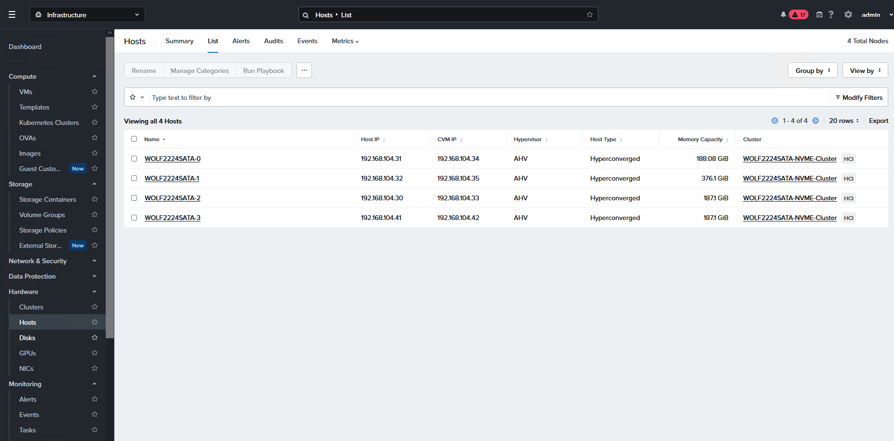
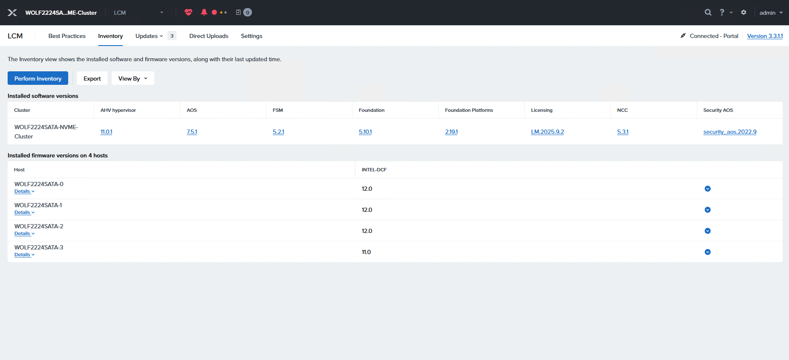
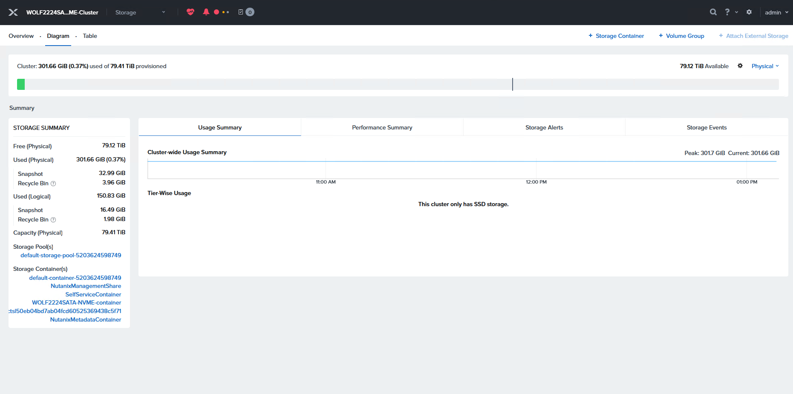
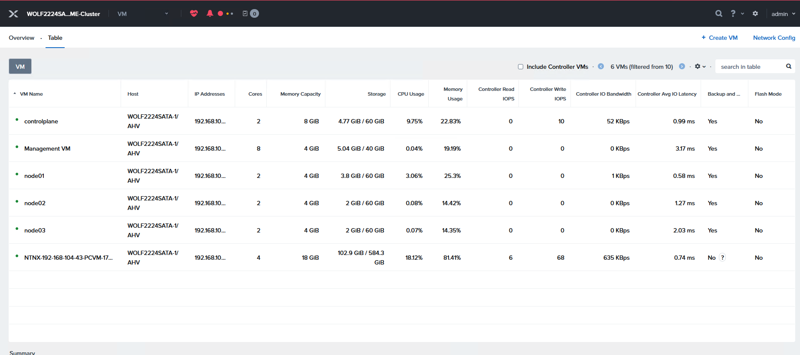
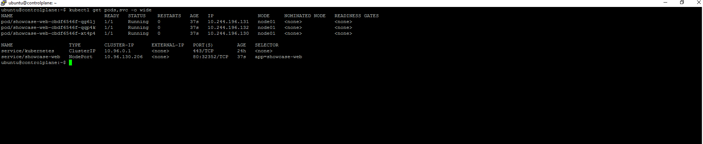

# Nutanix Kubernetes Bare-Metal Lab

A fully automated, production-inspired Kubernetes lab built on a physical Nutanix cluster — documenting the complete journey from bare-metal hardware to a monitored, hybrid-cloud Platform Engineering pipeline.

---

## About This Repository

This repository contains the complete Infrastructure as Code automation for my personal Homelab, built on a 4-node Intel Purley bare-metal cluster running the Nutanix Cloud Platform.

The goal is not just to study for certifications — it is to build a **Portfolio of Evidence** that demonstrates the ability to design, deploy, automate, and monitor an entire data center stack from hardware to container.

Every phase is documented as a reproducible guide, from provisioning VMs with Terraform to bootstrapping a production-grade Kubernetes cluster with kubeadm.

---

## Tech Stack

| Layer | Technology |
|---|---|
| Hardware | 4x Intel Bare-Metal Nodes (Purley Platform) |
| Virtualization | Nutanix Cloud Platform (AHV) |
| Infrastructure as Code | Terraform |
| Configuration Management | Ansible |
| Container Orchestration | Kubernetes (kubeadm) |
| Monitoring | Prometheus & Grafana |
| Cloud Integration | AWS (S3, hybrid backup) |


---

## Repository Structure

```
nutanix-k8s-baremetal/
├── .gitignore
├── ansible/
│   ├── ansible.cfg
│   ├── fix-hosts.yaml
│   ├── inventory.ini
│   └── k8s-prep.yaml
├── architecture/
│   ├── software-matrix.md
│   └── topology.md
├── docs/
│   └── screenshots/
│       ├── 1.- Cluster List - Prism Central.png
│       ├── 2.- SW diagram - Nutanix Prism Element.png
│       ├── 3.- Storage Diagram - Nutanix Prism Element.png
│       ├── 4.- VM Table - Nutanix Prism Element.png
│       ├── 5.- Kubernetes Cluster Status (CLI) - 'One Node added'.png
│       ├── 6.- Live Workload K8.png
│       ├── 7.- Status - Prism Central.png
│       └── README.md
├── Preview.md
├── tailored project guides/
│   ├── Installation Ubuntu Live Based.md
│   ├── Phase 1 - Terraform in detail.md
│   ├── Phase 2 - Ansible.md
│   └── Phase 3 - Kubeadm installation.md
├── terraform/
│   ├── main.tf
│   ├── providers.tf
│   ├── terraform.tfvars
│   └── variables.tf
└── README.md
```

---

## Lab Phases

| Phase | Guide | Status |
|---|---|---|
| Phase 0 | Ubuntu Management VM Setup | ✅ Complete |
| Phase 1 | Terraform VM Provisioning | ✅ Complete |
| Phase 2 | Ansible Configuration Management | ✅ Complete |
| Phase 3 | Kubeadm Cluster Bootstrap | ✅ Complete |
| Phase 4 | Observability - Prometheus & Grafana | 🔄 In Progress |
| Phase 5 | Cloud Jump - AWS Hybrid Integration | ⏳ Planned |

---

## Target Certifications

| Certification | Provider | Status |
|---|---|---|
| CKA - Certified Kubernetes Administrator | CNCF | 🔄 In Progress |
| AWS SAA - Solutions Architect Associate | Amazon | ⏳ Planned |

---

## Security Notice

> Security-sensitive configuration files (credentials, keys, secrets) are excluded from this repository via `.gitignore`.

---

## Evidence Screenshots

The following screenshots provide evidence that both the Nutanix platform and Kubernetes cluster are healthy and operational.

### Nutanix Cluster Health Status (1-4)

1. **Prism Dashboard:** high-level cluster health and alerts overview.



2. **Hardware Diagram:** node-level infrastructure visibility and component status.



3. **Storage Diagram:** storage topology and data path health validation.



4. **VM Table:** virtual machine inventory and runtime state confirmation.



### Kubernetes Cluster Working Evidence (5-6)

5. **Cluster Status (CLI):** control plane and node join validation from the command line.


6. **Live Workload:** workload running on the Kubernetes cluster.



---

## License

This project is for educational and portfolio purposes.

---

*Last Updated: June 2026*
